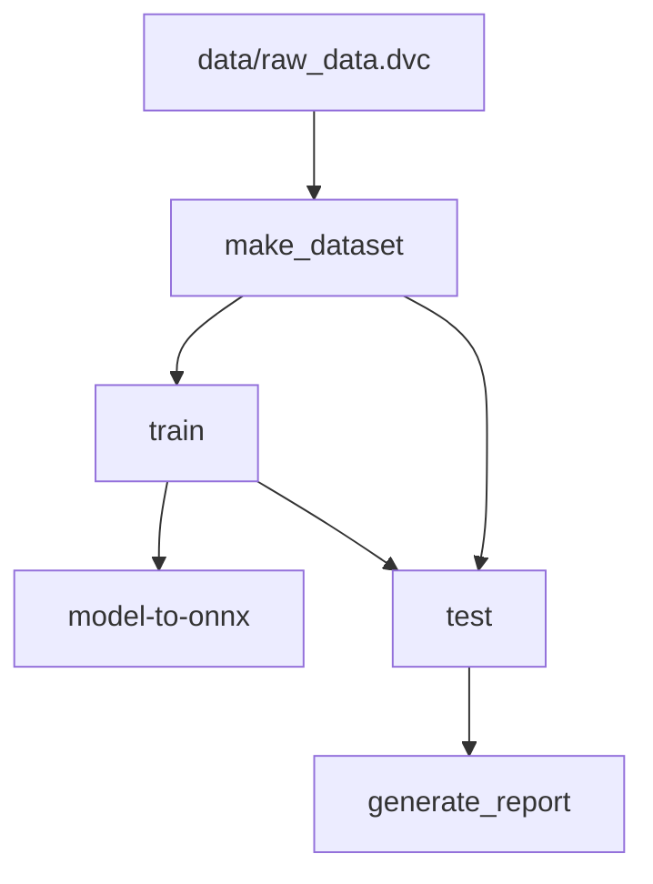

# DVC DAG

# DVC Metrics: Last changes
| Path   | Metric   | HEAD   | workspace   | Change   |
|--------|----------|--------|-------------|----------|

# DVC Metrics: All
| Path                       | Metric                 | HEAD   | workspace   | Change   |
|----------------------------|------------------------|--------|-------------|----------|
| metrics/metrics_test.json  | 0.f1-score             | 0.185  | 0.185       | 0.0      |
| metrics/metrics_test.json  | 0.precision            | 0.139  | 0.139       | 0.0      |
| metrics/metrics_test.json  | 0.recall               | 0.278  | 0.278       | 0.0      |
| metrics/metrics_test.json  | 0.support              | 18     | 18          | 0        |
| metrics/metrics_test.json  | 1.f1-score             | 0.242  | 0.242       | 0.0      |
| metrics/metrics_test.json  | 1.precision            | 0.286  | 0.286       | 0.0      |
| metrics/metrics_test.json  | 1.recall               | 0.211  | 0.211       | 0.0      |
| metrics/metrics_test.json  | 1.support              | 19     | 19          | 0        |
| metrics/metrics_test.json  | 10.f1-score            | 0.125  | 0.125       | 0.0      |
| metrics/metrics_test.json  | 10.precision           | 0.154  | 0.154       | 0.0      |
| metrics/metrics_test.json  | 10.recall              | 0.105  | 0.105       | 0.0      |
| metrics/metrics_test.json  | 10.support             | 19     | 19          | 0        |
| metrics/metrics_test.json  | 11.f1-score            | 0.187  | 0.187       | 0.0      |
| metrics/metrics_test.json  | 11.precision           | 0.231  | 0.231       | 0.0      |
| metrics/metrics_test.json  | 11.recall              | 0.158  | 0.158       | 0.0      |
| metrics/metrics_test.json  | 11.support             | 19     | 19          | 0        |
| metrics/metrics_test.json  | 12.f1-score            | 0.35   | 0.35        | 0.0      |
| metrics/metrics_test.json  | 12.precision           | 0.368  | 0.368       | 0.0      |
| metrics/metrics_test.json  | 12.recall              | 0.333  | 0.333       | 0.0      |
| metrics/metrics_test.json  | 12.support             | 21     | 21          | 0        |
| metrics/metrics_test.json  | 13.f1-score            | 0.308  | 0.308       | 0.0      |
| metrics/metrics_test.json  | 13.precision           | 0.273  | 0.273       | 0.0      |
| metrics/metrics_test.json  | 13.recall              | 0.353  | 0.353       | 0.0      |
| metrics/metrics_test.json  | 13.support             | 17     | 17          | 0        |
| metrics/metrics_test.json  | 14.f1-score            | 0.462  | 0.462       | 0.0      |
| metrics/metrics_test.json  | 14.precision           | 0.387  | 0.387       | 0.0      |
| metrics/metrics_test.json  | 14.recall              | 0.571  | 0.571       | 0.0      |
| metrics/metrics_test.json  | 14.support             | 21     | 21          | 0        |
| metrics/metrics_test.json  | 15.f1-score            | 0.364  | 0.364       | 0.0      |
| metrics/metrics_test.json  | 15.precision           | 0.429  | 0.429       | 0.0      |
| metrics/metrics_test.json  | 15.recall              | 0.316  | 0.316       | 0.0      |
| metrics/metrics_test.json  | 15.support             | 19     | 19          | 0        |
| metrics/metrics_test.json  | 16.f1-score            | 0.235  | 0.235       | 0.0      |
| metrics/metrics_test.json  | 16.precision           | 0.267  | 0.267       | 0.0      |
| metrics/metrics_test.json  | 16.recall              | 0.211  | 0.211       | 0.0      |
| metrics/metrics_test.json  | 16.support             | 19     | 19          | 0        |
| metrics/metrics_test.json  | 17.f1-score            | 0.517  | 0.517       | 0.0      |
| metrics/metrics_test.json  | 17.precision           | 0.395  | 0.395       | 0.0      |
| metrics/metrics_test.json  | 17.recall              | 0.75   | 0.75        | 0.0      |
| metrics/metrics_test.json  | 17.support             | 20     | 20          | 0        |
| metrics/metrics_test.json  | 18.f1-score            | 0.182  | 0.182       | 0.0      |
| metrics/metrics_test.json  | 18.precision           | 0.25   | 0.25        | 0.0      |
| metrics/metrics_test.json  | 18.recall              | 0.143  | 0.143       | 0.0      |
| metrics/metrics_test.json  | 18.support             | 21     | 21          | 0        |
| metrics/metrics_test.json  | 19.f1-score            | 0.368  | 0.368       | 0.0      |
| metrics/metrics_test.json  | 19.precision           | 0.35   | 0.35        | 0.0      |
| metrics/metrics_test.json  | 19.recall              | 0.389  | 0.389       | 0.0      |
| metrics/metrics_test.json  | 19.support             | 18     | 18          | 0        |
| metrics/metrics_test.json  | 2.f1-score             | 0.154  | 0.154       | 0.0      |
| metrics/metrics_test.json  | 2.precision            | 0.286  | 0.286       | 0.0      |
| metrics/metrics_test.json  | 2.recall               | 0.105  | 0.105       | 0.0      |
| metrics/metrics_test.json  | 2.support              | 19     | 19          | 0        |
| metrics/metrics_test.json  | 20.f1-score            | 0.596  | 0.596       | 0.0      |
| metrics/metrics_test.json  | 20.precision           | 0.538  | 0.538       | 0.0      |
| metrics/metrics_test.json  | 20.recall              | 0.667  | 0.667       | 0.0      |
| metrics/metrics_test.json  | 20.support             | 21     | 21          | 0        |
| metrics/metrics_test.json  | 21.f1-score            | 0.258  | 0.258       | 0.0      |
| metrics/metrics_test.json  | 21.precision           | 0.308  | 0.308       | 0.0      |
| metrics/metrics_test.json  | 21.recall              | 0.222  | 0.222       | 0.0      |
| metrics/metrics_test.json  | 21.support             | 18     | 18          | 0        |
| metrics/metrics_test.json  | 22.f1-score            | 0.222  | 0.222       | 0.0      |
| metrics/metrics_test.json  | 22.precision           | 0.192  | 0.192       | 0.0      |
| metrics/metrics_test.json  | 22.recall              | 0.263  | 0.263       | 0.0      |
| metrics/metrics_test.json  | 22.support             | 19     | 19          | 0        |
| metrics/metrics_test.json  | 23.f1-score            | 0.187  | 0.187       | 0.0      |
| metrics/metrics_test.json  | 23.precision           | 0.231  | 0.231       | 0.0      |
| metrics/metrics_test.json  | 23.recall              | 0.158  | 0.158       | 0.0      |
| metrics/metrics_test.json  | 23.support             | 19     | 19          | 0        |
| metrics/metrics_test.json  | 24.f1-score            | 0.512  | 0.512       | 0.0      |
| metrics/metrics_test.json  | 24.precision           | 0.458  | 0.458       | 0.0      |
| metrics/metrics_test.json  | 24.recall              | 0.579  | 0.579       | 0.0      |
| metrics/metrics_test.json  | 24.support             | 19     | 19          | 0        |
| metrics/metrics_test.json  | 25.f1-score            | 0.162  | 0.162       | 0.0      |
| metrics/metrics_test.json  | 25.precision           | 0.15   | 0.15        | 0.0      |
| metrics/metrics_test.json  | 25.recall              | 0.176  | 0.176       | 0.0      |
| metrics/metrics_test.json  | 25.support             | 17     | 17          | 0        |
| metrics/metrics_test.json  | 26.f1-score            | 0.452  | 0.452       | 0.0      |
| metrics/metrics_test.json  | 26.precision           | 0.538  | 0.538       | 0.0      |
| metrics/metrics_test.json  | 26.recall              | 0.389  | 0.389       | 0.0      |
| metrics/metrics_test.json  | 26.support             | 18     | 18          | 0        |
| metrics/metrics_test.json  | 27.f1-score            | 0.069  | 0.069       | 0.0      |
| metrics/metrics_test.json  | 27.precision           | 0.083  | 0.083       | 0.0      |
| metrics/metrics_test.json  | 27.recall              | 0.059  | 0.059       | 0.0      |
| metrics/metrics_test.json  | 27.support             | 17     | 17          | 0        |
| metrics/metrics_test.json  | 28.f1-score            | 0.318  | 0.318       | 0.0      |
| metrics/metrics_test.json  | 28.precision           | 0.304  | 0.304       | 0.0      |
| metrics/metrics_test.json  | 28.recall              | 0.333  | 0.333       | 0.0      |
| metrics/metrics_test.json  | 28.support             | 21     | 21          | 0        |
| metrics/metrics_test.json  | 29.f1-score            | 0.139  | 0.139       | 0.0      |
| metrics/metrics_test.json  | 29.precision           | 0.116  | 0.116       | 0.0      |
| metrics/metrics_test.json  | 29.recall              | 0.172  | 0.172       | 0.0      |
| metrics/metrics_test.json  | 29.support             | 29     | 29          | 0        |
| metrics/metrics_test.json  | 3.f1-score             | 0.154  | 0.154       | 0.0      |
| metrics/metrics_test.json  | 3.precision            | 0.25   | 0.25        | 0.0      |
| metrics/metrics_test.json  | 3.recall               | 0.111  | 0.111       | 0.0      |
| metrics/metrics_test.json  | 3.support              | 18     | 18          | 0        |
| metrics/metrics_test.json  | 30.f1-score            | 0.424  | 0.424       | 0.0      |
| metrics/metrics_test.json  | 30.precision           | 0.412  | 0.412       | 0.0      |
| metrics/metrics_test.json  | 30.recall              | 0.438  | 0.438       | 0.0      |
| metrics/metrics_test.json  | 30.support             | 16     | 16          | 0        |
| metrics/metrics_test.json  | 31.f1-score            | 0.378  | 0.378       | 0.0      |
| metrics/metrics_test.json  | 31.precision           | 0.389  | 0.389       | 0.0      |
| metrics/metrics_test.json  | 31.recall              | 0.368  | 0.368       | 0.0      |
| metrics/metrics_test.json  | 31.support             | 19     | 19          | 0        |
| metrics/metrics_test.json  | 32.f1-score            | 0.176  | 0.176       | 0.0      |
| metrics/metrics_test.json  | 32.precision           | 0.2    | 0.2         | 0.0      |
| metrics/metrics_test.json  | 32.recall              | 0.158  | 0.158       | 0.0      |
| metrics/metrics_test.json  | 32.support             | 19     | 19          | 0        |
| metrics/metrics_test.json  | 33.f1-score            | 0.533  | 0.533       | 0.0      |
| metrics/metrics_test.json  | 33.precision           | 0.667  | 0.667       | 0.0      |
| metrics/metrics_test.json  | 33.recall              | 0.444  | 0.444       | 0.0      |
| metrics/metrics_test.json  | 33.support             | 18     | 18          | 0        |
| metrics/metrics_test.json  | 34.f1-score            | 0.267  | 0.267       | 0.0      |
| metrics/metrics_test.json  | 34.precision           | 0.364  | 0.364       | 0.0      |
| metrics/metrics_test.json  | 34.recall              | 0.211  | 0.211       | 0.0      |
| metrics/metrics_test.json  | 34.support             | 19     | 19          | 0        |
| metrics/metrics_test.json  | 35.f1-score            | 0.333  | 0.333       | 0.0      |
| metrics/metrics_test.json  | 35.precision           | 0.353  | 0.353       | 0.0      |
| metrics/metrics_test.json  | 35.recall              | 0.316  | 0.316       | 0.0      |
| metrics/metrics_test.json  | 35.support             | 19     | 19          | 0        |
| metrics/metrics_test.json  | 36.f1-score            | 0.348  | 0.348       | 0.0      |
| metrics/metrics_test.json  | 36.precision           | 0.32   | 0.32        | 0.0      |
| metrics/metrics_test.json  | 36.recall              | 0.381  | 0.381       | 0.0      |
| metrics/metrics_test.json  | 36.support             | 21     | 21          | 0        |
| metrics/metrics_test.json  | 37.f1-score            | 0.108  | 0.108       | 0.0      |
| metrics/metrics_test.json  | 37.precision           | 0.111  | 0.111       | 0.0      |
| metrics/metrics_test.json  | 37.recall              | 0.105  | 0.105       | 0.0      |
| metrics/metrics_test.json  | 37.support             | 19     | 19          | 0        |
| metrics/metrics_test.json  | 38.f1-score            | 0.25   | 0.25        | 0.0      |
| metrics/metrics_test.json  | 38.precision           | 0.25   | 0.25        | 0.0      |
| metrics/metrics_test.json  | 38.recall              | 0.25   | 0.25        | 0.0      |
| metrics/metrics_test.json  | 38.support             | 20     | 20          | 0        |
| metrics/metrics_test.json  | 39.f1-score            | 0.298  | 0.298       | 0.0      |
| metrics/metrics_test.json  | 39.precision           | 0.25   | 0.25        | 0.0      |
| metrics/metrics_test.json  | 39.recall              | 0.368  | 0.368       | 0.0      |
| metrics/metrics_test.json  | 39.support             | 19     | 19          | 0        |
| metrics/metrics_test.json  | 4.f1-score             | 0.27   | 0.27        | 0.0      |
| metrics/metrics_test.json  | 4.precision            | 0.263  | 0.263       | 0.0      |
| metrics/metrics_test.json  | 4.recall               | 0.278  | 0.278       | 0.0      |
| metrics/metrics_test.json  | 4.support              | 18     | 18          | 0        |
| metrics/metrics_test.json  | 40.f1-score            | 0.368  | 0.368       | 0.0      |
| metrics/metrics_test.json  | 40.precision           | 0.35   | 0.35        | 0.0      |
| metrics/metrics_test.json  | 40.recall              | 0.389  | 0.389       | 0.0      |
| metrics/metrics_test.json  | 40.support             | 18     | 18          | 0        |
| metrics/metrics_test.json  | 41.f1-score            | 0.359  | 0.359       | 0.0      |
| metrics/metrics_test.json  | 41.precision           | 0.333  | 0.333       | 0.0      |
| metrics/metrics_test.json  | 41.recall              | 0.389  | 0.389       | 0.0      |
| metrics/metrics_test.json  | 41.support             | 18     | 18          | 0        |
| metrics/metrics_test.json  | 42.f1-score            | 0.233  | 0.233       | 0.0      |
| metrics/metrics_test.json  | 42.precision           | 0.175  | 0.175       | 0.0      |
| metrics/metrics_test.json  | 42.recall              | 0.35   | 0.35        | 0.0      |
| metrics/metrics_test.json  | 42.support             | 20     | 20          | 0        |
| metrics/metrics_test.json  | 43.f1-score            | 0.45   | 0.45        | 0.0      |
| metrics/metrics_test.json  | 43.precision           | 0.474  | 0.474       | 0.0      |
| metrics/metrics_test.json  | 43.recall              | 0.429  | 0.429       | 0.0      |
| metrics/metrics_test.json  | 43.support             | 21     | 21          | 0        |
| metrics/metrics_test.json  | 44.f1-score            | 0.242  | 0.242       | 0.0      |
| metrics/metrics_test.json  | 44.precision           | 0.286  | 0.286       | 0.0      |
| metrics/metrics_test.json  | 44.recall              | 0.211  | 0.211       | 0.0      |
| metrics/metrics_test.json  | 44.support             | 19     | 19          | 0        |
| metrics/metrics_test.json  | 45.f1-score            | 0.39   | 0.39        | 0.0      |
| metrics/metrics_test.json  | 45.precision           | 0.381  | 0.381       | 0.0      |
| metrics/metrics_test.json  | 45.recall              | 0.4    | 0.4         | 0.0      |
| metrics/metrics_test.json  | 45.support             | 20     | 20          | 0        |
| metrics/metrics_test.json  | 46.f1-score            | 0.108  | 0.108       | 0.0      |
| metrics/metrics_test.json  | 46.precision           | 0.111  | 0.111       | 0.0      |
| metrics/metrics_test.json  | 46.recall              | 0.105  | 0.105       | 0.0      |
| metrics/metrics_test.json  | 46.support             | 19     | 19          | 0        |
| metrics/metrics_test.json  | 47.f1-score            | 0.286  | 0.286       | 0.0      |
| metrics/metrics_test.json  | 47.precision           | 0.312  | 0.312       | 0.0      |
| metrics/metrics_test.json  | 47.recall              | 0.263  | 0.263       | 0.0      |
| metrics/metrics_test.json  | 47.support             | 19     | 19          | 0        |
| metrics/metrics_test.json  | 48.f1-score            | 0.108  | 0.108       | 0.0      |
| metrics/metrics_test.json  | 48.precision           | 0.118  | 0.118       | 0.0      |
| metrics/metrics_test.json  | 48.recall              | 0.1    | 0.1         | 0.0      |
| metrics/metrics_test.json  | 48.support             | 20     | 20          | 0        |
| metrics/metrics_test.json  | 49.f1-score            | 0.205  | 0.205       | 0.0      |
| metrics/metrics_test.json  | 49.precision           | 0.2    | 0.2         | 0.0      |
| metrics/metrics_test.json  | 49.recall              | 0.211  | 0.211       | 0.0      |
| metrics/metrics_test.json  | 49.support             | 19     | 19          | 0        |
| metrics/metrics_test.json  | 5.f1-score             | 0.364  | 0.364       | 0.0      |
| metrics/metrics_test.json  | 5.precision            | 0.429  | 0.429       | 0.0      |
| metrics/metrics_test.json  | 5.recall               | 0.316  | 0.316       | 0.0      |
| metrics/metrics_test.json  | 5.support              | 19     | 19          | 0        |
| metrics/metrics_test.json  | 6.f1-score             | 0.343  | 0.343       | 0.0      |
| metrics/metrics_test.json  | 6.precision            | 0.375  | 0.375       | 0.0      |
| metrics/metrics_test.json  | 6.recall               | 0.316  | 0.316       | 0.0      |
| metrics/metrics_test.json  | 6.support              | 19     | 19          | 0        |
| metrics/metrics_test.json  | 7.f1-score             | 0.057  | 0.057       | 0.0      |
| metrics/metrics_test.json  | 7.precision            | 0.067  | 0.067       | 0.0      |
| metrics/metrics_test.json  | 7.recall               | 0.05   | 0.05        | 0.0      |
| metrics/metrics_test.json  | 7.support              | 20     | 20          | 0        |
| metrics/metrics_test.json  | 8.f1-score             | 0.062  | 0.062       | 0.0      |
| metrics/metrics_test.json  | 8.precision            | 0.071  | 0.071       | 0.0      |
| metrics/metrics_test.json  | 8.recall               | 0.056  | 0.056       | 0.0      |
| metrics/metrics_test.json  | 8.support              | 18     | 18          | 0        |
| metrics/metrics_test.json  | 9.f1-score             | 0.1    | 0.1         | 0.0      |
| metrics/metrics_test.json  | 9.precision            | 0.095  | 0.095       | 0.0      |
| metrics/metrics_test.json  | 9.recall               | 0.105  | 0.105       | 0.0      |
| metrics/metrics_test.json  | 9.support              | 19     | 19          | 0        |
| metrics/metrics_test.json  | accuracy               | 0.282  | 0.282       | 0.0      |
| metrics/metrics_test.json  | macro avg.f1-score     | 0.276  | 0.276       | 0.0      |
| metrics/metrics_test.json  | macro avg.precision    | 0.287  | 0.287       | 0.0      |
| metrics/metrics_test.json  | macro avg.recall       | 0.281  | 0.281       | 0.0      |
| metrics/metrics_test.json  | macro avg.support      | 961    | 961         | 0        |
| metrics/metrics_test.json  | weighted avg.f1-score  | 0.276  | 0.276       | 0.0      |
| metrics/metrics_test.json  | weighted avg.precision | 0.286  | 0.286       | 0.0      |
| metrics/metrics_test.json  | weighted avg.recall    | 0.282  | 0.282       | 0.0      |
| metrics/metrics_test.json  | weighted avg.support   | 961    | 961         | 0        |
| metrics/metrics_train.json | accuracy               | 0.998  | 0.998       | 0.0      |
| metrics/metrics_train.json | val_accuracy           | 0.265  | 0.265       | 0.0      |

# DVC Params: Last changes
| Param   | HEAD   | workspace   |
|---------|--------|-------------|

# DVC Params: All
| Param                      | HEAD                         | workspace                    |
|----------------------------|------------------------------|------------------------------|
| common.metrics_path        | metrics/                     | metrics/                     |
| common.plots_path          | plots/                       | plots/                       |
| common.seed                | 1337                         | 1337                         |
| eval.confusion_matrix_path | plots/conf_matrix_val.png    | plots/conf_matrix_val.png    |
| eval.data_path             | data/split_data/val/         | data/split_data/val/         |
| model.batch_size           | 8                            | 8                            |
| model.image_size           | [224, 224]                   | [224, 224]                   |
| model.model_name           | efficientnetv2_b0            | efficientnetv2_b0            |
| model.model_onnx_path      | models/onnx/model.onnx       | models/onnx/model.onnx       |
| model.model_pb_path        | models/pb/                   | models/pb/                   |
| split.metrics_path         | metrics/metrics_dataset.json | metrics/metrics_dataset.json |
| split.raw_data_path        | data/raw_data/               | data/raw_data/               |
| split.split_data_path      | data/split_data/             | data/split_data/             |
| split.test_split           | 0.2                          | 0.2                          |
| split.train_split          | 0.6                          | 0.6                          |
| split.validation_split     | 0.2                          | 0.2                          |
| test.confusion_matrix_path | plots/conf_matrix_test.png   | plots/conf_matrix_test.png   |
| test.data_path             | data/split_data/test/        | data/split_data/test/        |
| test.metrics_path          | metrics/metrics_test.json    | metrics/metrics_test.json    |
| train.accuracy_plot_path   | plots/model_accuracy.png     | plots/model_accuracy.png     |
| train.data_path            | data/split_data/train/       | data/split_data/train/       |
| train.epochs               | 3                            | 3                            |
| train.learning_rate        | 0.01                         | 0.01                         |
| train.loss_plot_path       | plots/model_loss.png         | plots/model_loss.png         |
| train.metrics_path         | metrics/metrics_train.json   | metrics/metrics_train.json   |

